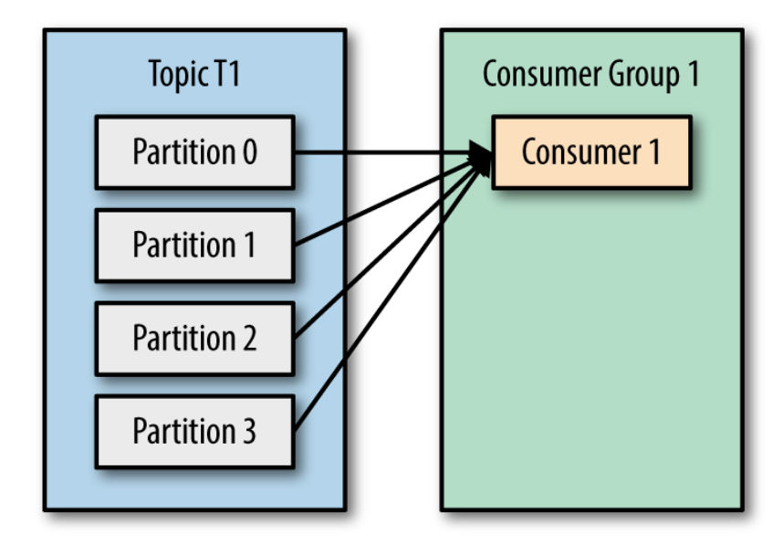
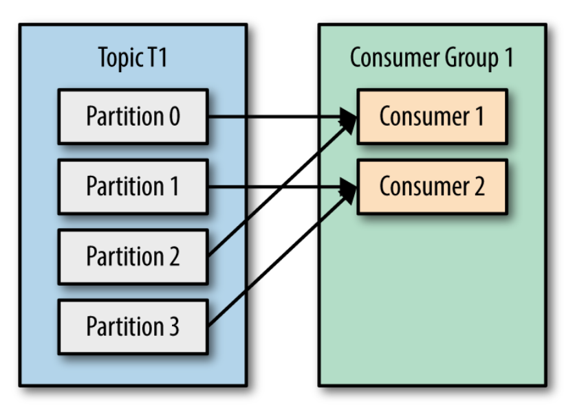
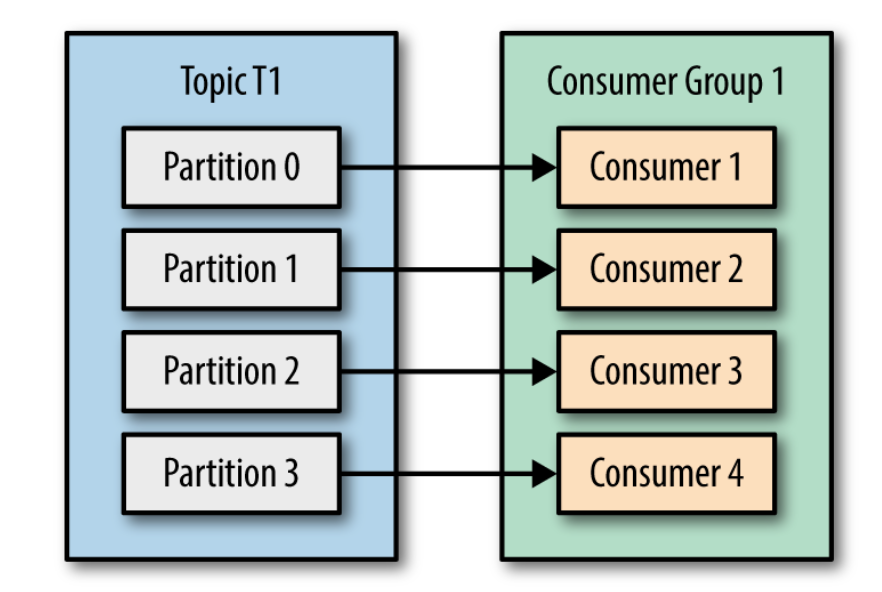
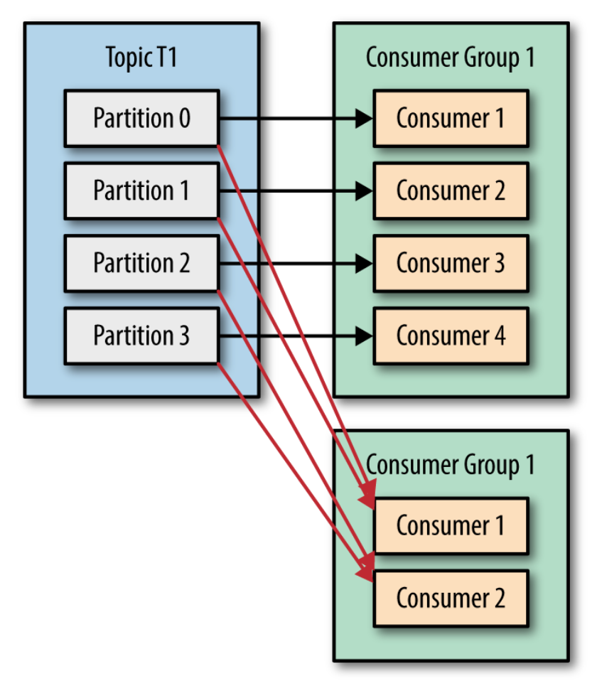
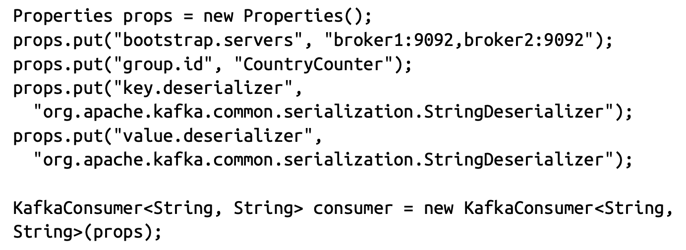
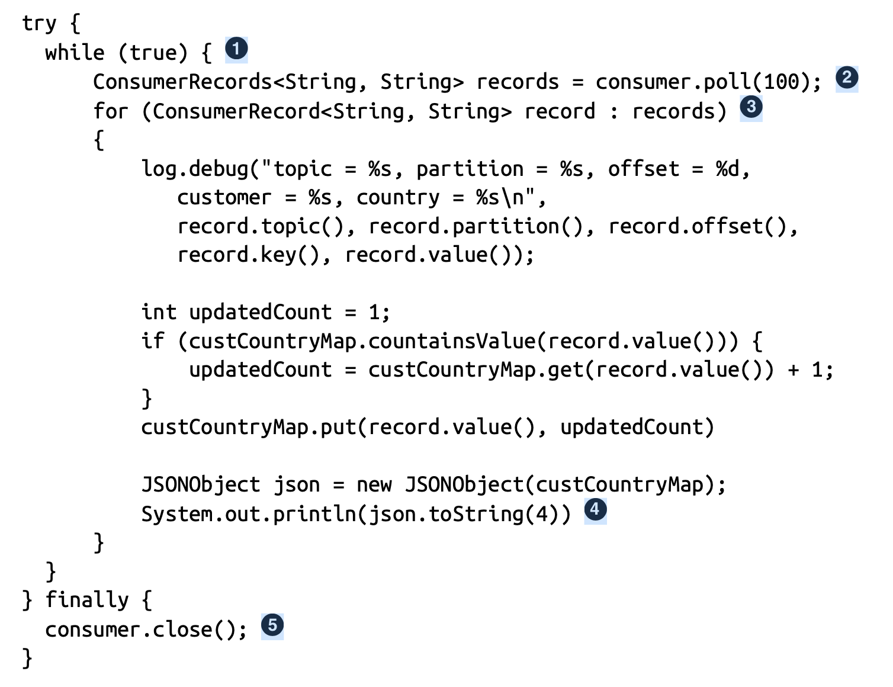
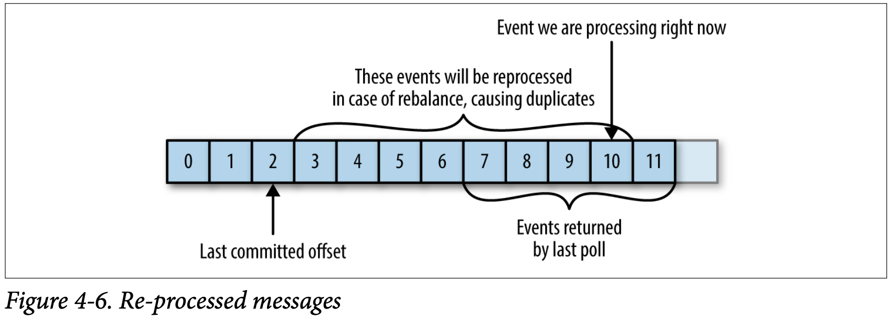

# Kafka Consumers: Đọc dữ liệu từ Kafka

Ứng dụng cần đọc dữ liệu từ Kafka sử dụng một KafkaConsumer để subscribe tới các Kafka topics và nhận messages từ các topics. Đọc dữ liệu từ Kafka có một chút khác biệt hơn sơ với đọc dữ liệu từ các hệ thống message khác. Có một chút khái niệm riêng biệt và các ý tưởng liên quan tới. Sẽ khó để hiểu làm thế nào để sử dụng consumer API mà không hiểu những khái niệm này trước.

## Các khái niệm Kafka Consumer

### Consumers và Consumer Groups

Giả sử bạn cần đọc message từ một Kafka topic, chạy một số xác thực đối với chúng và lưu dữ liệu vào một kho lưu trữ dữ liệu khác. Trong trường hợp này ứng dụng sẽ tạo một đối tượng consumer, subscribe tới một topic phù hợp, và bắt đầu nhận message, validate chúng và viết ra kết quả. Điều này có thể hoạt động tốt trong một thời gian, nhưng điều gì xảy ra nếu tốc độ producer ghi message cho một topic vượt quá tốc độ mà ứng dụng của bạn có thể validate chúng? Nếu bạn bị giới hạn với một consumer đọc và xử lý dữ liệu, ứng dụng của bạn có thể bị tụt lại phía sau và không thể theop kịp tốc độ message tới. Giống như nhiều producer có thể gửi message cho 1 topic, Kafka cho phép nhiều consumers đọc dữ liệu từ một topic, phân chia dữ liệu giữa chúng (các consumers). 

Các Kafka consumer là một phần của consumer group. Khi nhiều consumers theo dõi một topic, mỗi một consumer trong group sẽ nhận được message từ các tập hợp con khác nhau của một partition trong chủ đề.

Ví dụ có một chủ đề T1 với 4 partitions, bây giờ chúng ta tạo một Consumer C1, là consumer duy nhất trong Group, và sử dụng nó để subscribe tới topic T1. Consumer C1 sẽ lấy tất cả messages từ 4 partitions của T1.

Nếu chúng ta thêm một consumer khác, C2 tới group G1, mỗi consumer sẽ chỉ lấy các messages từ hai partitions. Có lẽ các messages từ partition 0 và 2 sẽ được chuyển đến C1 (consumer 1), message từ partition 1 và partition 3 được chuyển tới C2 (consumer 2).

Nếu G1 (Group) có 4 consumers, thì mỗi consumer sẽ đọc message từ một partition riêng. Xem hình bên dưới:

Nếu chúng ta thêm nhiều consumers tới một Group đơn hơn số partition trong Group có, một vài consumers sẽ không làm gì và sẽ không nhận message.

Cách chính để mở rộng (scale - tăng) việc tiêu thụ message từ một Kafka topic là việc thêm nhiều consumers hơn tới một consumer group.

Thông thường Kafka consumer thường thực hiện các hoạt động có độ trễ cao như ghi vào cơ sở dữ liệu hoặc tính toán tốn thời gian trên dữ liệu. Trong những trường hợp này, một consumer không thể theo kịp tốc độ luồng dữ liệu vào một topic và việc thêm nhiều consumers chia sẻ tải bằng cách để mỗi consumer chỉ sở hữu một tập hợp con các partitions.

Thêm các consumers để mở rộng(scale) một ứng dụng đơn, rất là phổ biến để có nhiều ứng dụng mà đọc dữ liệu từ cùng một topic. Trong thực tế, một trong những mục tiêu thiết kế chính của Kafka là cung cấp dữ liệu được tạo ra cho các Kafka topics cho nhiều trường hợp sử dụng trong toàn tổ chức. Trong những trường hợp đó, chúng ta muốn mỗi ứng dụng nhận tất cả các messages trong một topic. Để đảm bảo ứng dụng nhận được tất cả messages trong một topic, hãy đảm bảo ứng dụng có nhóm consumers riêng. Không giống như các hệ thống message truyền thống, Kafka mở rộng số lượng consumers và consumer groups mà không làm giảm hiệu suất. 

Trong ví dụ trước, nếu chúng ta thêm một nhóm Consumer mới G2 với một consumer duy nhất, consumer này sẽ nhận được tất cả các message trong topic T1 độc lập với những gì G1 (nhóm G1) đang làm. G2 có thể có nhiều hơn 1 consumer, trong trường hợp đó, mỗi consumer sẽ nhận được một tập hợp con các partitions, giống như đã trình bày với G1, nhưng G2 nói chung sẽ vẫn nhận được tất cả các message bất kể các nhóm consumer khác.

Tóm lại, bạn tạo ra một nhóm consumer mới cho mỗi ứng dụng cần tất cả các message từ một hoặc nhiều topic. Bạn thêm consumer vào consumer group hiện có để có thể mở rộng quy mô đọc và xử lý message từ các topic, do đó, mỗi consumer bổ sung trong group sẽ chỉ nhận được một tập hợp con các messages.

### Consumer Group và tái cân bằng phân vùng (Partition Rebalance)

Như đã thấy trong phần trước, các consumers trong consumer group  chia sẻ quyền sở hữu phân vùng trong các topic mà chúng đăng ký (subscribe). Khi chúng ta thêm một consumer tới group, nó bắt đầu tiêu thụ các message được tiêu thụ trước đó bởi các group khác. Điều tương tự xảy ra khi một consumer bị dừng hoặc xoá, nó rời group, và các phân vùng nó từng tiêu thụ (consume) sẽ được tiêu thụ bởi một trong các consumer còn lại.

Việc chỉ định lại partition cho consumer cũng xảy ra khi các topics mà nhóm consumer (consumer group) đang bị sửa đổi (Ví dụ nếu quản trị viên thêm phân vùng mới).

Việc chuyển quyền sở hữu phân vùng từ consumer này qua consumer khác được gọi là tái cân bằng. Tái cân bằng rất quan trọng vì chúng cung cấp cho consumer group tính sẵn sàng và khả năng mở rộng cao (cho phép chúng ta thêm và loại bỏ consumer một cách dễ dàng và an toàn). Trong quá trình tái cân bằng, consumer không thể consume (tiêu thụ) message. Do đó, về cơ bản, tái cân bằng chỉ là một khoảng thời gian ngắn khi toàn bộ consumer group không có mặt. Ngoài ra, khi các partition chuyển từ consumer này qua consumer khác, consumer sẽ mất trạng thái hiện tại; nếu nó đang lưu vào bộ nhớ đệm hiện tại bất kỳ dữ liệu nào, nó sẽ cần phải làm mới bộ đệm của nó.

Cái cách consumer duy trì tư cách thành viên trong consumer group và quyền sở hữu các partition được chỉ định cho chúng là gửi heartbeats (nhịp tim) đến Kafka Broker được chỉ định làm điều phối viên nhóm (Broker này có thể khác nhau với các consumer group khác nhau). Miễn là consumer gửi heartbeats đều đặn, nó được coi là vẫn hoạt động tốt và xử lý các message từ các phân vùng của nó. Heartbeats được gửi khi consumer thăm dò ý kiến (consumer polls) (nhận các bản ghi - retrieves records) và khi nó xác nhận các records nó đã sử dụng.

Nếu consumer ngừng gửi heartbeats đủ lâu, phiên của nó sẽ hết thời gian và điều phối viên sẽ coi nó đã chết và kích hoạt tái cân bằng. Nếu 1 consumer gặp sự cố và dừng tiêu thụ message, điều phối viên nhóm (group coodinator) sẽ mất vài giây để quyết định rằng nó đã chết. Khi đóng sạch consumer, consumer sẽ thông báo cho điều phối viên rằng họ sẽ rời đi và điều phối viên sẽ tái cân bằng ngay lập tức, giảm khoảng cách trong quá trình xử lý.

### Note: Thay đổi hành vi heartbeats trong phiên bản Kafka hiện tại

> Trong phiên bản phát hành 0.10.1, cộng đồng Kafka đã giới thiệu một chuỗi nhịp tim (heartbeats) riêng biệt mà sẽ gửi nhịp tim giữa các cuộc thăm dò. Điều này cho phép bạn tách tần số nhịp tim (heartbeats frequency) (và do đó, phải mất bao nhiêu lâu để consumer group phát hiện ra rằng consumer gặp sự cố và không gửi heartbeat nữa) khỏi tần số bỏ phiếu (frequencey of polling) (được xác định bằng thời gian cần thiết để xử lý dữ liệu được trả ra từ broker). Với phiên bản mới của Kafka, bạn có thể cấu hình thời gian ứng dụng có thể hoạt động mà không cần bỏ phiếu trước khi ứng dụng rời nhóm và kích hoạt tái cân bằng. Cấu hình này được sử dụng để chặn một livelock (được hiểu là ứng dụng không gặp sự cố nhưng không đạt được tiến độ xử lý vì một lý do nào đó). Cấu hình này tách biệt với session.time.out.ms, cấu hình này kiểm soát thời gian cần thiết để phát hiện sự cố của consumer và ngừng gửi heartbeat. Phần còn lại sẽ thảo luận về một số thách thức như ứng dụng mất nhiều thời gian hơn (take longer to) để xử lý record. Nếu bạn đang sử lý version mới của Kafka và cần xử lý các bản ghi(record) mất nhiều thời gian, bạn chỉ cần điều chỉnh max.poll.interval.ms để nó xử lý độ trễ lâu hơn giữa việc thăm dò các bản ghi mới.

> Quy trình phân bổ phân vùng (assigning partition) cho Broker hoạt động như thế nào?
> Khi một consumer muốn tham gia (join) và một nhóm (group), nó gửi một yêu cầu JoinGroup tới trình điều phối nhóm (group coordinator). Consumer đầu tiên tham gia vào group trở thành nhóm trưởng (group leader). Nhóm trưởng nhận một danh sách các nhóm (group) từ trình điều phối nhóm (group coordination) (điều này bao gồm tất cả các consumer đã gửi heartbeat gần đây và do đó được coi là còn sống) và chịu trách nhiệm gán một tập hợp con các partitions (phân vùng) tới mỗi consumer. Nó sử dụng một triển khai của PartitionAssignor để quyết định những phân vùng nào sẽ được gán tới consumer nào.

> Kafka có 2 chính sách(policies) gán phân vùng được xây sẵn (build in), chúng ta sẽ thảo luận nhiều hơn trong phần cấu hình. Sau khi quyết định trình gán phân vùng, nhóm trưởng gửi một danh sách bản liên kết (assignments) tới GroupCoordinator, trình điều phối sẽ gửi những thông tin này tới tất cả các consumers. Mỗi consumer sẽ chỉ thấy liên kết riêng của nó, chỉ có nhóm trưởng mới có toàn bộ danh sách các consumers và các liên kết của nó tới partitions. Tiến trình này được lặp lại mỗi lần tái cân bằng xảy ra.  

### Tạo Một Kafka Consumer

Bước đầu tiên để bắt đầu tiêu thụ một record là tạo một thể hiện KafkaConsumer. Tạo một KafkaConsumer cũng tương tự như tạo một KafkaProducer - bạn tạo một thể hiện Properties Java cùng với các properties mà bạn muốn truyền tới consumer. Để bắt đầu chúng ta sử dụng 3 thuộc tính bắt buộc: bootstrap.server, key.deserializer, value.deserializer.

Thuộc tính đầu tiên bootstrap.server là chuỗi kết nối tới một Kafka cluster.

key.serializer và value.serializer chỉ rõ class sẽ làm phẳng đối tượng Java từ định dạng byte arrays. Bạn cần chỉ rõ classes mà có thể nhận byte array và trả nó ra đối tượng Java.

Có 4 thuộc tính không bắt buộc. Thuộc tính group.id để chỉ rõ consumer group thể hiện KafkaConsumer thuộc vào. Trong khi có thể tạo các consumer không thuộc vào bất kỳ consumer group nào, nhưng nó không phổ biến.

đoạn code sau thể hiện làm thế nào tạo một KafkaConsumer:

### Subscribing to Topics
Một khi chúng ta tạo một consumer, bước tiếp theo là subscribe tới một hoặc nhiều topics. Phương thức subscribe() tạo một danh sách các topics như một tham số, vì thế nó rất dễ sử dụng:
> consumer.subscribe(Collections.singletonList("customerCountries"));

Ở đây chúng ta tạo một danh sách phần tử đơn: topic name là customerCountries.

Nó đồng thời có thể subscribe với một regular expression. Expression có thể khớp với nhiều topic mới. Nếu ai đó tạo một topic name mà khớp với expression, một rebalance (tái cân bằng) sẽ xảy ra gần như ngay lập tức và các consumers bắt đầu tiêu thụ từ topic mới. Điều này hữu dụng cho các ứng dụng mà cần tiêu thụ (consume) từ nhiều topics và có thể xử lý nhiều kiểu dữ liệu mà topic sẽ chứa. Subscribe nhiều topics sử dụng một regular expression là trường hợp phổ biến được sử dụng trong các ứng dụng mà bản sao dữ liệu giữa Kafka và hệ thống khác.

Để subscribe tới tất cả các topic test, chúng ta có thể:
> consumer.subscribe("test.*");

### The Poll Loop
Trọng tâm của consumer API là một vòng lặp đơn giản để thăm dò máy chủ (server) có thêm dữ liệu. 

Mỗi khi có consumers subscribe tới topics, poll loop sẽ xử lý tất cả chi tiết từ việc điều phối, tái cân bằng phân vùng, heartbeats (lắng nghe nhịp tim), và lấy dữ liệu. Body chính của một consumer sẽ trông như thế này:

(1) Đây thực sự là một vòng lặp vô hạn. Các consumers là những ứng dụng liên tục thăm dò Kafka để có thêm dữ liệu.

(2) Đây là dòng quan trọng nhất trong chương. Tương tự như cách những con cá mập phải tiếp tục di chuyển nếu không sẽ chết, consumer phải tiếp tục thăm dò Kafka nếu không nó sẽ bị coi là đã chết và các partition mà consumer đang tiêu thụ sẽ được giao cho một consumer khác trong nhóm để tiếp tục tiêu thụ. Tham số chúng ta truyền vào poll(), là khoảng thời gian chờ và kiểm soát thời gian poll() sẽ chặn nếu dữ liệu không có sẵn trong bộ đệm của consumer. Nếu giá trị này được đặt thành 0, poll() sẽ trả về ngay lập tức; nếu không, nó sẽ đợi số milli giây được chỉ định để dữ liệu nhận được từ Broker.

(3) poll() trả ra một danh sách của records. Mỗi record chứa topic và partition mà bản ghi đến từ đó. Offset của bản ghi trong phân vùng, key và value của bản ghi. Thông thường, chúng ta muốn lặp lại danh sách và xử lý các bản ghi riêng lẻ. Phương thức poll() lấy tham số hết thời gian chờ. Điều này chỉ định để cuộc thăm dò trở lại, có hoặc không có dữ liệu. Giá trị này thường được điều khiển bởi nhu cầu của ứng dụng để có thể phản hồi nhanh - bạn muốn trả lại quyền kiểm soát cho luồng thực hiện bỏ phiếu nhanh đến mức nào?

(4) Xử lý thường kết thúc bằng việc viết kết quả vào một data store hoặc cập nhật một record được lưu trữ.

(5) Luôn luôn close() consumer trước khi thoát. Điều này sẽ đóng kết nối network và sockets. Nó đồng thời kích hoạt việc tái cân bằng ngay lập tức thay vì đợi điều phối viên nhóm phát hiện ra rằng consumer đã ngừng gửi heartbeat và có khả năng đã chết, việc này mất nhiều thời gian hơn và do đó dẫn đến một khoảng thời gian dài hơn mà consumer không thể đọc message từ tập hợp con của các phân vùng.

poll loop làm nhiều hơn là chỉ get data. Lần đầu tiên bạn gọi poll() với một consumer mới, nó chịu trách nhiệm tìm kiếm GroupCoordinator, tham gia consumer group và nhận partition được gán tới. Và dĩ nhiên heartbeats giữ consumer còn sống được gửi từ bên trong vòng thăm dò ý kiến (poll loop).

### Thread Safe
Bạn không thể có nhiều consumers mà thuộc cùng một group trong 1 thread (luồng) và bạn không thể có nhiều thread safety sử dụng cùng consumer. Một consumer trên một thread là luật (rule). Để chạy nhiều consumer trong cùng group trong cùng 1 ứng dụng, bạn sẽ cần chạy nó trong từng thread riêng. Sẽ rất hữu ích nếu bao bọc logic consumer trong đối tượng của chính nó và sau đó sử dụng ExecutorService của Java để bắt đầu nhiều luồng với mỗi luồng consumer riêng của nó.

### Cấu hình Consumer
// TODO:

### Commits và Offsets
Bất cứ khi nào chúng ta gọi poll(), nó trả ra các bản ghi (records) được viết tới Kafka mà consumer trong group của chúng ta chưa đọc. Điều này có nghĩa rằng chúng ta có cách để theo dõi những records nào được đọc bởi consumer trong group. Như đã thảo luận trước đó, một trong những đặc điểm độc đáo của Kafka là nó không theo dõi xác nhận (acknowledgement) từ consumer theo cách mà nhiều hàng đợi JMS thực hiện. Thay vào đó, nó cho phép consumer sử dụng Kafka để theo dõi vị trí(offset) của chúng(consumer) trong mỗi phân vùng (partition).

Chúng ta gọi hành động cập nhật vị trí hiện tại của partition là **commit**.
Làm thế nào một consumer commit một offset? Nó tạo một message tới Kafka, tới một topic đặc biệt là _consumer_offset, cùng với offset được commit cho mỗi partition. Nếu một consumer gặp sự cố hoặc một consumer mới gia nhập consumer group, điều này sẽ gây ra tái cân bằng. Sau khi tái cân bằng, mỗi consumer có thể được chỉ định 1 bộ phân vùng mới so với bộ phân vùng đã dùng trước đó, để biết consumer nào sẽ được chọn để làm việc, consumer sẽ đọc phần offset được commit mới nhất của từng phân vùng và tiếp tục từ đó.

Nếu offset đã được commit nhỏ hơn offset của last message, chứng tỏ message chưa được consume hết. Những messages giữa last message offset và offset được commit sẽ được tiếp tục xử lý (những offset bị vênh giữa offset của last message và offset được gửi tới _consumer_offset).

Nếu commited offset (offset đã được commit) lớn hơn offset của last message mà client thực sự đã xử lý, tất cả messages -> messages bị thiếu trong consumer group.

Rõ ràng, quản lý các offset có một ảnh hưởng lớn đến ứng dụng client. KafkaConsumer API cung cấp nhiều cách của các offset đang commit.

### Automatic Commit (Tự động commit)
Cách đơn giản nhất để lưu giữ commit là cho phép consumer làm nó cho bạn. Nếu bạn cấu hình enable.auto.commit=true, thì mỗi 5 giây consumer sẽ commit cái offset lớn nhất mà client của bạn nhận được từ poll(). Khoảng thời gian 5 giây là mặc định và được cài đặt bởi auto.commit.interval.ms. Giống như mọi thứ khác trong consumer, commit tự động được điều khiển bởi poll loop. Bất cứ khi nào bạn thăm dò (poll), consumer sẽ kiểm tra nếu là thời gian commit, nó sẽ commit offset và trả ra offset cuối cùng trong poll.

Cần cân nhắc, commit tự động xảy ra cứ mỗi 5 giây. Giả sử rằng chúng ta đang ở giây thứ 3 sau commit gần nhất và sự kiện tái cân bằng (rebalance) xảy ra. Sau khi tái cân bằng, tất cả consumers sẽ bắt đầu tiêu thụ (consume) từ offset cuối cùng được commit. Trong trường hợp này, những offset đã được commit từ 3 giây sẽ bị xử lý hai lần. Có thể cấu hình khoảng thời gian commit thường xuyên hơn để giảm thiểu các bản ghi bị trùng lặp, tuy nhiên nó không hoàn toàn loại bỏ nó.

Với tự động commit, một cuộc gọi tới poll sẽ luôn luôn commit offset cuối cùng được trả ra bởi poll(cuộc thăm dò) trước.

### Commit Offset hiện tại
Nhằm loại bỏ khả năng thiếu message và giảm số lượng message trùng lặp trong quá trình tái cân bằng. Consumer API có tuỳ chọn commit offset hiện tại tại một điểm có ý nghĩa đối với nhà phát triển ứng dụng thay vì dựa trên bộ đếm thời gian.