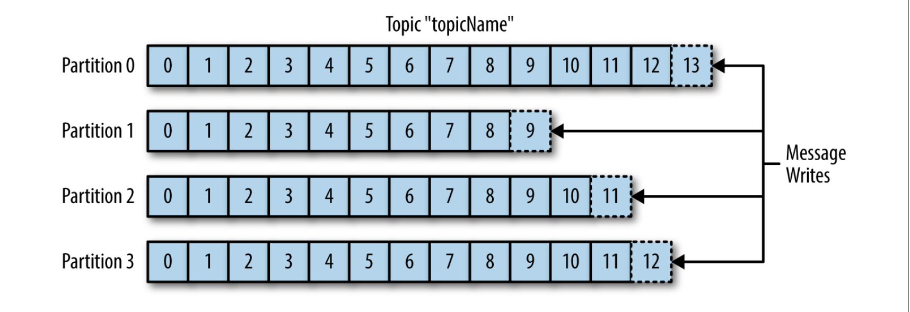
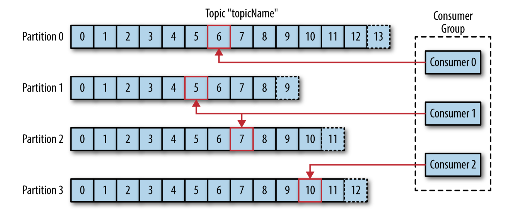
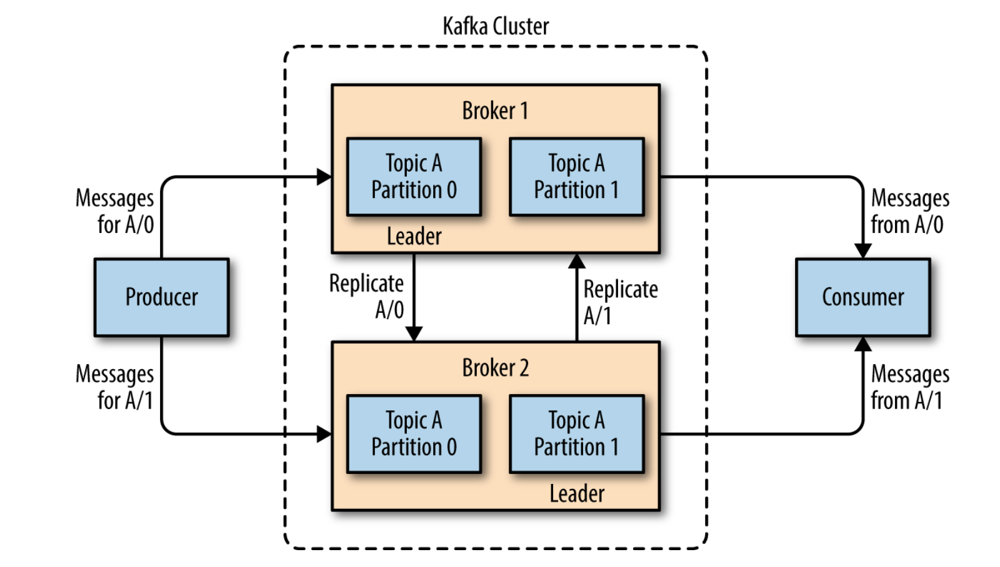

# Kafka Overview

## Publish/Subscribe messaging

 Publish/Subscribe messaging là một mẫu (pattern) được đặc trưng bởi người gửi (publisher) một phần dữ liệu (message) không hướng nó tới một người nhận cụ thể. Thay vào đó, publisher sẽ phân loại message bằng một cách nào đó và người nhận (subscriber) đó đăng ký nhận các loại message nhất định. Các hệ thống pub/sub thường có một nhà môi giới (broker), một điểm trung tâm nơi các message được xuất bản (publish).

## Messages và Batches

Đơn vị của dữ liệu trong Kafka được gọi là <em>message</em>. Nếu bạn đang tiếp cận Kafka từ nền tảng cơ sở dữ liêu, bạn có thể nghĩ nó như một **row** hoặc một **record**.

Theo Kafka, một message chỉ đơn giản là một mảng bytes, vì vậy dữ liệu chứa trong nó không có định dạng hoặc ý nghĩa cụ thể đối với Kafka.

Key là một mảng byte và cũng như message, không có ý nghĩa cụ thể. Key được sử dụng khi message ghi vào phân vùng (partition) theo cách được kiểm soát chặt chẽ hơn. Message có cùng key sẽ được ghi vào cùng một partition.

Để hiệu quả, message được ghi vào Kafka theo từng lô (batch). Lô là một tập hợp message, tất cả đều được tạo cho cùng một chủ đề và một partition (phân vùng). Lô càng lớn thì càng nhiều tin nhắn có thể được xử lý trên một đơn vị thời gian, nhưng thời gian truyền một tin nhắn đi sẽ lâu hơn. Các lô cũng thường được nén, cung cấp khả năng truyền và lưu trữ dữ liệu hiệu quả hơn.

## Topic và Partition

Message trong Kafka được tổ chức vào các topics. Phân tích gần gũi nhất cho topic là database table hoặc các folder. Topics cũng được chia nhỏ thành các partition. Partition giống như một commit log đơn. Message được ghi vào đó và được đọc theo thứ tự từ đầu tới cuối. Lưu ý rằng một topic có nhiều partition nên không có gì đảm bảo về thứ tự thời gian của message trên toàn bộ topic, chỉ trong một partition duy nhất. Partitions cũng là cách để Kafka cung cấp khả năng dự phòng và khả năng mở rộng. Mỗi partition có thể lưu trữ trên một máy chủ khác nhau, điều đó có nghĩa là một topic có thể được mở rộng theo chiều ngang trên nhiều máy chủ để mang lại hiệu suất vượt xa khả năng của một máy chủ.

Thuật ngữ **Stream** thường được sử dụng khi thảo luận về dữ liệu trong các hệ thống như Kafka. Thông thường, một stream thường được xem xét là một topic đơn nhất của dữ liệu, bất kể số partitions. Điều này biểu diễn một luồng đơn của dữ liệu di chuyển từ producers tới consumers. Cách đề cập đến này là phổ biến nhất khi thảo luận về stream processing (xử lý luồng), đó là khi các Framworks - một trong số đó là Kafka Streams, Apache Samza, và Storm - vận hành trên các message trong thời gian thực. Phương thức hoạt động này có thể được so sánh với các offline framework, cụ thể là Hadoop, được thiết kế để hoạt động trên dữ liệu lớn tại một thời điểm sau đó (không phải thời gian thực).

## Producers và Consumers

Kafka clients là các users của hệ thống, và có hai kiểu cơ bản: producers và consumers.

**Producers** tạo các message, trong các hệ thống pub/sub khác có thể được gọi là publishers hoặc writers. Thông thường, một message sẽ thường được tạo tới một topic nhất định. Thông thường, producer không quan tâm partition nào một message được viết tới và sẽ cân bằng messages trên tất cả các partitions của một topic một cách đồng đều. Điều này đặc biệt được hoàn tất bằng việc sử dụng message key và một partitioner mà sẽ tạo một hash của key được viết tới cùng partition. Điều này đảm bảo rằng tất cả messages được tạo cùng một key được đưa ra sẽ được ghi tới cùng partition. Producer đồng thời có thể sử dụng một partitions tinh chỉnh(custom) mà theo các luật riêng để ánh xạ message tới partition.

**Consumers** đọc message. Trong các hệ thống pub/sub khác được gọi là subscribers hoặc readers. Consumer theo dõi một hoặc nhiều topics và đọc messages theo thứ tự mà chúng đã được tạo ra.

Consumers theo dõi những messages nào đã sử dụng bằng cách theo dõi offset của message. Offset là một số nguyên tăng liên tục - mà Kafka thêm vào mỗi message khi nó được tạo ra. Mỗi message trong một partitions nhất định có một offset duy nhất. Bằng cách lưu vào offset của message được tiêu thụ cuối cùng cho mỗi partitions, trong Zookeeper hoặc trong Kafka, consumers có thể dừng hoặc khởi động lại mà không mất vị trí.

Các consumers làm việc như một phần của **consumer group**, một hoặc nhiều consumers làm việc cùng với nhau để tiêu thụ messages của một topic. Nhóm (Group) đảm bảo rằng mỗi partition được tiêu thụ bởi chỉ một thành viên. Hình dưới mô tả có ba consumers trong một group đang tiêu thụ một topic. Hai trong số các consumers đang làm việc trên cùng một partition, trong khi consumer thứ 3 đang làm việc trên hai partitons. Việc mapping (ánh xạ) một consumer tới một partition thường được gọi là quyền sở hữu phân vùng (partition) của một consumer.

Theo cách này, consumers có thể mở rộng theo chiều ngang để tiêu thụ các topics với số lượng lớn messages. Thêm vào đó, nếu một consumer fail, các thành viên còn lại trong group sẽ cân bằng lại các partitions được sử dụng để thay thế các thành viên còn thiếu.

## Brokers và Clusters

Một Kafka server được gọi là một broker. Broker nhận message từ producers, gán offset tới chúng, và commit các messages để lưu vào ổ cứng. Nó đồng thời phục vụ các consumers, đáp ứng yêu cầu tìm nạp cho các partitions và phản hồi bằng các messages đã được committed vào ổ cứng. Phụ thuộc vào phần cứng cụ thể và đặc tính hiệu suất của nó, một broker có thể dễ dàng xử lý hàng nghìn partition và hàng triệu messages mỗi giây.

Kafka broker được thiết kế để hoạt động như một phần của cluster. Trong một nhóm (cluster) của các brokers, một broker sẽ đóng vai trò người điều khiển (controller - được bầu từ các thành viên trực tiếp của một cụm (cluster)). Controller chịu trách nhiệm quản trị các hoạt động, bao gồm gán các partitions tới brokers và giám sát việc các brokers bị lỗi. Một partitions được làm chủ bởi một broker duy nhất trong cụm máy chủ(cluster) và broker đó được gọi là leader của partitions đó. Một partition có thể được gán tới nhiều brokers, điều này dẫn tới việc phân vùng đó sẽ bị sao chép.

Tính năng chính của Apache Kafka là khả năng lưu trữ, tức là lưu trữ lâu dài các messages trong một khoảng thời gian.

Kafka brokers được cấu hình với thời gian lưu giữ mặc định cho các topics, hoặc lưu giữ message trong một khoảng thời gian(ví dụ: 7 ngày) hoặc cho đến khi topic đạt đến kích thước nhất định(ví dụ: 1GB). Sau khi đạt đến các giới hạn này, message hết hạn sẽ bị xoá để cấu hình lưu giữ và lượng dữ liệu tối thiểu có sẵn bất cứ lúc nào. Các topic riêng lẻ cũng có thể được cấu hình với cài đặt riêng của chúng để các messages được lưu giữ trong thời gian chúng còn hữu ích. Ví dụ, topic theo dõi có thể được giữ lại trong vài ngày, trong khi ứng dụng số liệu (metric application) chỉ có thể lưu giữ lại trong vài giờ.

## Nhiều clusters (Mutiple clusters)

Khi việc triển khai Kafka phát triển, việc có nhiều clusters thường có lợi. Có một số lý do tại sao điều này có ích:
- Phân chia các loại dữ liệu
- Cách ly vì yêu cầu bảo mật
- Nhiều trung tâm dữ liệu khác nhau (Khắc phục thảm hoạ)

Đặc biệt khi làm việc với nhiều trung tâm dữ liệu (multiple datacenters), messages thường được yêu cầu phải được sao chép giữa chúng. Theo cách này, các ứng dụng online có thể được theo dõi được hành vi người dùng ở cả hai bên. Ví dụ, nếu user thay đổi thông tin (public profile) của họ, sự thay đổi đó cần được hiển thị trong sự tìm kiếm ở bất kể datacenter nào. Hoặc, giám sát dữ liệu có thể được thu thập từ nhiều sites vào một vùng dữ liệu trung tâm (data center) duy nhất nơi ở nơi các hệ thống phân tích hoặc hệ thống cảnh báo được đặt. Cơ chế sao chép dữ liệu trong Kafka clusters được thiết kế chỉ làm việc trên một cluster duy nhất, ko làm việc giữa các cluster.

## Tại sao lại Kafka?

Có nhiều sự lựa chọn của các hệ thống messages publish/subscribe, tại sao Kafka lại là sự lựa chọn tốt?

### Multiple Producers

Kafka có thể xử lý liền mạch nhiều producers, cho dù những client đó đang xử lý nhiều topic hay cùng topic. Điều này làm cho hệ thống trở nên lý tưởng để tổng hợp dữ liệu từ nhiều hệ thống giao diện người dùng và làm cho nó nhất quán.

### Nhiều Consumers

Ngoài nhiều producers, kafka thiết kế có nhiều consumers để đọc bất kỳ luồng message nào mà không can thiệp lẫn nhau. Điều này ngược lại với nhiều hệ thống hàng đợi nơi mà một message được tiêu thụ bởi một client thì nó không có sẵn cho client khác. Nhiều consumers có thể chọn hoạt động như một phần của nhóm và chia sẻ luồng, đảm bảo rằng toàn bộ nhóm chỉ xử lý một tin nhắn nhất định 1 lần. 

### Disk-Base Retetion (Lưu giữ trên ổ cứng)
Kafka không chỉ có thể xử lý nhiều consumers mà còn có khả năng lưu trữ message lâu dài -> có nghĩa là consumer không phải lúc nào cũng cần phải làm việc trong thời gian thực (work in real time). Các messages được lưu giữ (commit - cam kết, lưu giữ) vào ổ cứng, và sẽ được lưu giữ theo cấu hình thời gian lưu giữ (configurable retention rules). Lựa chọn này có thể được cấu hình dựa theo từng topic, cho phép các luồng(stream) messages có thời gian lưu giữ message khác nhau phụ thuộc vào consumer cần. Thời gian lưu giữ (durable retention) có nghĩa là nếu một consumer bị lỗi (falls behind), do xử lý chậm hoặc do lưu lượng truy cập tăng vọt (a brust in traffic) nên có nguy cơ mất dữ liệu. Điều đó cũng có nghĩa là việc bảo trì có thể được thực hiện trên consumers, cho phép ứng dụng ngoại tuyến (offline) trong một khoảng thời gian ngắn mà không cần lo lắng về việc làm sao sao lưu message trên producers hoặc bị mất dữ liệu. 

### Khả năng mở rộng (Scalable)
Khả năng mở rộng linh hoạt giúp Kafka xử lý số lượng lớn dữ liệu. Các người dùng có thể bắt đầu với một single broker (một broker duy nhất) để tìm hiểu về khái niệm, mở rộng ra một cụm (cluster) bao gồm 3 brokers và mở rộng sang môi trường production với một cluster lớn hơn gồm hàng chục thậm chí hàng trăm brokers và phát triển theo thời gian khi dữ liệu mở rộng. Khả năng mở rộng có thể được thực thi trong khi cluster đang hoạt động (online) mà không ảnh hưởng tới tính khả dụng của toàn bộ hệ thống.

### Hiệu suất cao (High performance)
Tất cả các tính năng này kết hợp với nhau làm cho hệ thống pub/sub message là Kafka có một hiệu suất xuất sắc bên dưới khả năng chịu tải cao. Các producers, consumers, brokers đều có thể mở rộng để xử lý luồng dữ liệu lớn một cách dễ dàng. Điều này vẫn có thể được thực hiện trong khi vẫn cung cấp độ trễ dưới giây (bé hơn đơn vị giây) cho đến khi consumers sẵn sàng.

## Các trường hợp sử dụng (Use cases)

### theo dõi hành động (Activity Tracking)
Đây là trường hợp gốc tạo ra Kafka, được thiết kế tại LinkedIn,để theo dõi hành vi của người dùng. Một ứng dụng người dùng tương tác với ứng dụng FrontEnd, tạo ra các thông báo (message) liên quan đến hành vi mà người dùng đang thực hiện. 

Điều này có thể là thông tin thụ động, có thể là lượt xem trang web và theo dõi nhấp chuột hoặc có thể là các hành động phức tạp hơn, chẳng hạn như là thông tin mà người dùng thêm vào hồ sơ(profile) của họ. Các messages được published (đẩy) tới một hoặc nhiều topics, sau đó được tiêu thụ (consumed) bởi các ứng dụng backend. Những ứng dụng này có thể tạo ra báo cáo, cung cấp cho hệ thống học máy (machine learning), cập nhật kết quả tìm kiếm hoặc thực hiện các hoạt động khác cần thiết để mang lại trải nghiệm phong phú cho người dùng.

### Messaging (Thông báo, message)
Kafka đồng thời được sử dụng cho messaging, có thể là ứng dụng cần gửi thông báo (chẳng hạn như email) tới người dùng. Những ứng dụng này có thể tạo message mà không cần lo lắng về định dạng hoặc làm thế nào message được gửi đi. Một ứng dụng duy nhất có thể đọc tất cả các messages được gửi và xử lý chúng thống nhất, bao gồm:
- Định dạng message bằng cách sử dụng giao diện chung.
- Tập hợp nhiều message vào một thông báo duy nhất được gửi.
- Áp dụng các tuỳ chọn của người dùng (user) về cách họ muốn nhận message.

Sử dụng một ứng dụng duy nhất cho những việc này để tránh việc lặp lại các chức năng trong nhiều ứng dụng cũng như cho phép các hoạt động tổng hợp mà không thể thực hiện được.

### Theo dõi và ghi nhật ký (Metrics and logging)
Kafka đồng thời lý tưởng cho ứng dụng tập hợp, ứng dụng theo dõi (metrics) và ghi nhật ký (logging). Đây là trường hợp sử dụng trong đó khả năng có nhiều ứng dụng tạo ra cùng một loại thông báo. Các ứng dụng xuất bản các số liệu một cách thường xuyên tới một topic của Kafka và các số liệu đó có thể được các hệ thống sử dụng để theo dõi và cảnh báo. Chúng cũng có thể được sử dụng trong hệ thống ngoại tuyến (offline) như Hadoop để thực hiện phân tích dài hạn hơn, chẳng hạn như dự báo tăng trưởng. Log messages có thể được xuất bản theo cách tương tự và có thể được định tuyến đến các hệ thống tìm kiếm log chuyên dụng như Elasticsearch hoặc ứng dụng phân tích bảo mật.

### Commit log
Bởi vì Kafka dựa trên một khái niệm của commit log, sự thay đổi của database có thể được đẩy tới Kafka và các ứng dụng có thể dễ dàng giám sát (monitor) luồng dữ liệu này để nhận sự thay đổi ngay lập tức khi chúng xảy ra. Luồng nhật ký thay đổi này có thể được sử dụng để sao chép các bản cập nhật cơ sở dữ liệu sang hệ thống từ xa hoặc để hợp nhất các thay đổi từ nhiều ứng dụng vào một database view duy nhất. Ở đây, khả năng lưu trữ lâu dài rất hữu ích trong việc cung cấp vùng đệm cho nhật ký thay đổi, nghĩa là nó có thể phát lại trong trường hợp ứng dụng tiêu thụ (consumer) bị lỗi.

### Stream processing
