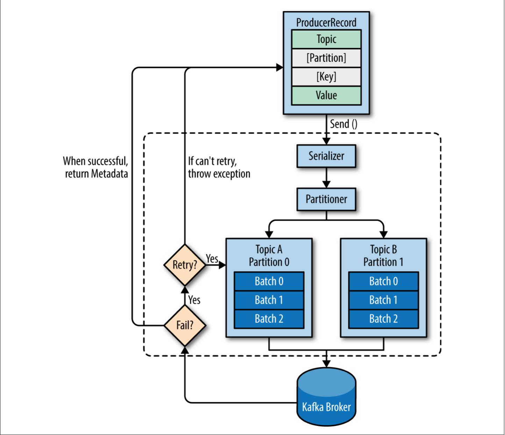

# Kafka Producers

Bất kể bạn sử dụng Kafka như một mesage queue, message bus hay một data storage platform, bạn sẽ luôn luôn sử dụng Kafka bằng việc viết một producer mà viết data tới Kafka, một consumer mà đọc data từ Kafka, hoặc một ứng dụng phục vụ cả hai.

Ví dụ, trong một hệ thống xử lý giao dịch credit card, có một ứng dụng khách (ví dụ online store) chịu trách nhiệm gửi mỗi giao dịch tới Kafka ngay lập tức khi mà việc thanh toán được tạo. Một ứng dụng khác chịu trách nhiệm ngay lập tức kiểm tra giao dịch này có chống lại một số quy tắc để quyết định giao dịch được thực thi hay bị từ chối. Cái phản hồi chấp nhận/từ chối có thể được viết ngược trở lại Kafka và phản hồi có thể được truyền ngược lại ứng dụng online store nơi mà giao dịch được hình thành. Một ứng dụng thứ ba có đọc cả các giao dịch và trạng thái (approve/deny) từ Kafka và lưu chúng vào database nơi mà các nhà phân tích có thể xem lại sau này để quyết định và có thể cải tiến các luật (rules).

Có nhiều lý do ứng dụng cần viết messages to Kafka:

-	Ghi lại hành động của user để kiểm toán, phân tích
-	Ghi lại các số liệu
-	Lưu nhật ký (log) các tin nhắn
-	Ghi lại các thông tin từ các ứng dụng thông minh, giao tiếp bất đồng bộ với các ứng dụng khác, các thông tin đệm trước khi lưu xuống DB, etc …


Một trường hợp sử dụng khác là lưu trữ thông tin nhấp chuột từ một trang web. Trong trường hợp này có thể mất một vài message, hoặc bị lặp lại có thể xảy ra; độ trễ có thể cao miễn là không ảnh hưởng tới trải nghiệm người dùng. Nói cách khác, chúng ta không quan tâm nếu mất vài giây để message tới Kafka, miễn là page tiếp theo được tải ngay sau khi người dùng nhấp vào link liên kết. Thông lượng sẽ phụ thuộc vào mức độ hoạt động mà chúng ta dự đoán trên trang web của mình.

Các yêu cầu khác nhau sẽ ảnh hưởng tới cách chúng ta sử dụng API producer để write message tới Kafka và cấu hình của chúng ta.

Các bước chính liên quan tới việc send message tới Kafka được minh hoạ trong hình sau:

  

Chúng ta bắt đầu tạo message tới Kafka bằng việc tạo ProduceRecord, nó phải bao gồm topic mà chúng ta muốn gửi record tới và message. Tuỳ chọn, chúng ta có thể gửi một key và/hoặc một partition. Một khi chúng ta gửi một ProduceRecord, điều đầu tiên mà producer làm là nén (serialize) key và value sang dạng ByteArrays để có thể gửi chúng qua mạng (network). Tiếp theo dữ liệu được gửi tới một partitioner. Nếu chúng ta chỉ rõ partition trong ProducerRecord, partitioner đơn giản không làm điều gì mà chỉ trả ra partition mà chúng ta đã chỉ rõ. Nếu chúng ta không làm điều đó, partitioner sẽ chọn một partition cho chúng ta, thông thường sẽ dựa trên ProducerRecord key. Một partition được chọn, producer biết topic nào và partition nào message sẽ được gửi tới. Nó sau đó sẽ thêm record tới một batch records mà sẽ đồng thời được gửi tới cùng topic và partition. Một luồng (thread) riêng biệt sẽ chịu trách nhiệm gửi các batch records này tới các Kafka brokers thích hợp.

Khi broker nhận message, nó gửi ngược lại một phản hồi (response). Nếu như các message đã thành công ghi tới Kafka, nó sẽ trả ra một đối tượng RecordMetadata với topic, partition và offset của record trong partition. Nếu broker thất bại việc ghi message, nó sẽ trả ra một lỗi. Khi mà một producer nhận một error, nó sẽ thử gửi lại message một vài lần (retry) trước khi từ bỏ và trả về một error.

## 1.  Xây dựng một Kafka Producer

Bước đầu tiên trong việc ghi các message tới Kafka là tạo ra một Producer object cùng với các thuộc tính mà bạn muốn cấu hình cho producer. Một Kafka producer có 3 thuộc tính bắt buộc:

-   <em>bootstrap.servers</em>

    Là một danh sách các cặp host:port của các brokers mà producer sẽ sử dụng để thiết lập các cài đặt kết nối tới Kafka cluster. Danh sách này không cần tất cả các brokers, bởi vì producer sẽ lấy thêm thông tin sau khi cài đặt kết nối. Nhưng nó được khuyến khích bao gồm tối thiểu hai, vì thế mà trong trường hợp một broker không hoạt động, producer sẽ vẫn có thể kết nối tới cluster. 
    
-   <em>key.serializer</em>

    Tên của class mà sẽ được sử dụng để tuần tự hoá (chuyển qua dạng bytearrays) keys của các records sẽ được produce (tạo) tới Kafka. Kafka brokers mong đợi các byte arrays của key và value của message. Tuy nhiên, producer interface cho phép, sử dụng các kiểu tham số hoá, bất kỳ đối tượng Java nào được gửi như một key – value. Điều này làm có thể đọc code, đồng thời producer phải biết làm thế nào để chuyển các đối tượng này tới byte arrays. Thuộc tính này nên được thiết lập tới tên của class mà implements interface **org.apache.kafka.common.serialization.Serializer**. Producer sẽ sử dụng class này để tuần tự đối tượng key tới byte arrays. Thuộc tính này là bắt buộc thậm chí bạn chỉ gửi value.

-   <em>value.serializer</em>

    Tên class sẽ được sử dụng để nén value của records sẽ được produce tới Kafka.

```yml
spring:
  kafka:
    demo:
      bootstrap-servers: ${KAFKA_RESERVATION_BOOTSTRAP_SERVERS:localhost:29092}
      topic:
        demo: demo

```

```java
package com.demo.kafka.kafka_practice.config;

import org.apache.kafka.clients.producer.ProducerConfig;
import org.springframework.beans.factory.annotation.Value;
import org.springframework.context.annotation.Bean;
import org.springframework.context.annotation.Configuration;
import org.springframework.kafka.core.DefaultKafkaProducerFactory;
import org.springframework.kafka.core.KafkaTemplate;
import org.springframework.kafka.core.ProducerFactory;
import org.springframework.kafka.support.serializer.JsonSerializer;

import java.util.HashMap;
import java.util.Map;

@Configuration
public class KafkaProducerConfig {

    @Value("${spring.kafka.demo.bootstrap-servers}")
    private String bootstrapServers;

    @Bean
    public <K, V>ProducerFactory<K, V> createDemoProducerFactory() {
        Map<String, Object> producerConfig = new HashMap<>();

        producerConfig.put(ProducerConfig.BOOTSTRAP_SERVERS_CONFIG, bootstrapServers);
        producerConfig.put(ProducerConfig.KEY_SERIALIZER_CLASS_CONFIG, JsonSerializer.class);
        producerConfig.put(ProducerConfig.VALUE_SERIALIZER_CLASS_CONFIG, JsonSerializer.class);

        return new DefaultKafkaProducerFactory<>(producerConfig);
    }

    @Bean
    public <K, V> KafkaTemplate<K, V> createDemoKafkaTemplate() {
        return new KafkaTemplate<>(createDemoProducerFactory());
    }
}

```

Một khi chúng ta cài đặt xong producer, có ba phương thức chính để send message:

-   <em>fire-and-forgot</em>: Chúng ta gửi message tới server mà không thực sự quan tâm server nhận thành công hay không. Hầu hết, nó sẽ nhận thành công bởi vì Kafka có tính sẵn sàng cao và producer sẽ retry việc gửi lại message tự động. Tuy nhiên, một vài message có thể bị mất khi sử dụng phương thức này.

-   <em>synchronous send (gửi đồng bộ)</em>: Chúng ta gửi một message, phương thức send() trả về một Future object, và chúng ta sử dụng get() để đợi tương lai xem phương thức send() thành công hay không.

-   <em>asynchoronous send (gửi bất đồng bộ)</em>: Chúng ta gọi phương thức send() với một callback function, nó sẽ được kích hoạt khi nó nhận một phản hồi (response) từ Kafka broker.

Chúng ta sẽ xem xét làm thế nào để gửi các messages sử dụng những phương thức này và làm thế nào để xử lý (kiểm soát – handle) các kiểu lỗi khác nhau có thể xảy ra.

Trong khi tất cả các ví dụ trong chương này là single threaded, một đối tượng producer có thể được sử dụng bởi multiple threads để gửi message. Bạn có thể sẽ muốn bắt đầu với một producer và một thread. Nếu bạn cần thông lượng tốt hơn, bạn có thể thêm nhiều threads sử dụng cùng producer. Một khi thông lượng tăng lên, bạn cần thêm nhiều producers để đạt được thông lượng cao hơn.

## Gửi một message tới Kafka

Cách đơn giản nhất để gửi một message tới Kafka như sau:
```java
try {
    producer.send(new ProducerRecord<>("test", "key", "value"));
} catch (Exception ex) {
    log.error(ex.getMessage());
}
```

producer chấp nhận một đối tượng ProducerRecord, vì thế chúng ta sẽ tạo một. ProducerRecord có nhiều constructor, chúng ta sử dụng constructor mà yêu cầu tên của topic chúng ta sẽ gửi dữ liệu tới. Kiểu của key và value phải trùng khớp với kiểu serializer và producer.

Chúng ta sử dụng phương thức send() của đối tượng producer để gửi một ProducerRecord, message sẽ được đưa tới một bộ đệm (buffer) và sẽ được gửi tới broker trong một thread riêng biệt. Phương thức send trả về một đối tượng Future của JAVA cùng với RecordMetadata, nhưng bởi vì chúng ta lờ đi giá trị được trả về, chúng ta sẽ không biết được rằng message đã được gửi đi thành công hay chưa. Phương pháp này có thể được sử dụng khi việc gửi message một cách im lặng được chấp nhận. Đây thường không phải là trường hợp được sử dụng trong các ứng dụng production.

Trong khi bỏ qua các lỗi có thể xảy ra khi gửi các messages tới Kafka broker hoặc trong bản thân broker, chúng ta có thể vẫn nhận về một exception nếu producer gặp phải các lỗi trước khi gửi message tới Kafka. Chúng có thể là SerializationException khi lỗi nén các message, lỗi BufferExhaustedException hoặc TimeoutException nếu như bộ đệm (buffer) bị đầy, hoặc InterruptException nếu luồng gửi (thread) bị gián đoạn.

## Gửi đồng bộ một message

```java
public void sendSynchronous() {
    try {
        producer.send(new ProducerRecord<>("test", "key", "value")).get();
    } catch (Exception ex) {
        ex.printStackTrace();
    }
}
```

Chúng ta sử dụng Future.get() để đợi phản hồi (reply) từ Kafka. Phương thức này sẽ ném ra một exception nếu như record chưa được gửi thành công tới Kafka. Nếu không có lỗi, chúng ta sẽ nhận được một đối tượng RecordMetadata mà chúng ta có thể sử dụng để lấy offset(vị trí) của message đã được ghi.

Nếu có bất kỳ lỗi nào trước khi gửi dữ liệu tới Kafka, trong khi gửi, nếu Kafka broker trả lại một ngoại lệ không thể truy xuất được hoặc nếu chúng ta đã dùng hết số lần retry có sẵn, chúng ta sẽ gặp phải một exception.

KafkaProducer có hai kiểu lỗi. Lỗi retryable có thể giải quyết được bằng cách gửi lại message. Ví dụ, lỗi kết nối có thể được giải quyết bằng cách kết nối có thể được thiết lập lại. Lỗi "no leader" có thể được giải quyết bằng cách bầu lên một leader mới cho partition. KafkaProducer có thể được cấu hình để thử lại các lỗi đó, do đó, code ứng dụng sẽ chỉ nhận được các exception có thể truy xuất được khi đã hết số lần retry và lỗi không thể giải quyết được. Ví dụ, "messsage size too large". Trong những trường hợp đó, KafkaProducer sẽ không retry và trả ra exception ngay lập tức.

## Gửi bất đồng bộ một message

```java
package com.demo.kafka.kafka_practice.service;


import org.apache.kafka.clients.producer.Callback;
import org.apache.kafka.clients.producer.RecordMetadata;

import java.util.Objects;

public class DemoAsynchronousProducerCallback implements Callback {
    @Override
    public void onCompletion(RecordMetadata recordMetadata, Exception e) {
        if (Objects.nonNull(e)) {
            e.printStackTrace();
        }
    }
}
```

```java
public void sendAsynchronous() {
    producer.send(new ProducerRecord<>("test", "asynchronous", "asynchronous value"), new DemoAsynchronousProducerCallback());
}
```

Để sử dụng callbacks, chúng ta cần một class triển khai (implements) interface <em>org.apache.kafka. clients.producer.Callback</em> với một phương thức duy nhất onCompletion(). (Chú ý: Interface Callback của thư viện Kafka).

Nếu Kafka trả ra lỗi, onCompletion() sẽ có một nonnull exception, ở đây chúng ta xử lý bằng việc in ra nó, nhưng môi trường production có thể có chức năng xử lý lỗi mạnh mẽ hơn.

## Cấu hình Producer

Có rất nhiều tham số cấu hình cho producers, chỉ có các tham số bootstrap.server và serializer(key, value) là bắt buộc. Cấu hình Producers có nhiều tham số mặc định hợp lý nên không có lý do gì phải sửa đổi(tinker = sửa đổi) từng tham số. Tuy nhiên, một vài tham số có tác động đáng kể đến việc sử dụng bộ nhớ, hiệu suất và độ tin cậy của các producers.

- **acks**

    Tham số này kiểm soát số lượng bản sao phân vùng (partition replicas) phải nhận bản ghi (record) trước khi producer có thể coi việc ghi(write) là thành công. Tuỳ chọn này có tác động đáng kể đến khả năng message bị mất. Có 3 giá trị được cho phép cho tham số acks:

    -   Nếu acks = 0, producer không đợi phản hồi từ broker trước khi cho rằng tin nhắn đã được gửi thành công. Điều này có nghĩa rằng nếu sự cố xảy ra và broker không nhận được tin nhắn thì producer sẽ không biết về điều đó và tin nhắn sẽ bị mất. Tuy nhiên vì producer không đợi bất kỳ phản hồi nào từ máy chủ nên nó có thể gửi tin nhắn nhanh như mạng(network) hỗ trợ. Cài đặt này có thể được sử dụng để đạt được thông lượng (thoughput) rất cao.

    - Nếu acks = 1, producer sẽ nhận một phản hồi thành công từ broker vào thời điểm bản sao leader (leader replicas) nhận được message. Nếu message không được ghi tới leader (ví dụ leader bị crash và leader mới chưa được bầu), producer sẽ nhận một lỗi phản hồi (error response) và có thể lặp lại (retry) việc gửi message, tránh khả năng mất dữ liệu. Message có thể vẫn bị mất leader gặp sự cố và một bản sao không có message này được bầu lên làm leader mới. Với trường hợp này, thông lượng sẽ phù thuộc vào việc gửi message đồng bộ hay không đồng bộ. Nếu client của chúng ta đợi phản hồi từ server (bằng việc gọi phương thức get() của đối tượng Future khi gửi message) nó sẽ tăng độ trễ lên một cách đáng kể. Nếu client sử dụng callbacks, độ trễ sẽ bị ẩn nhưng thông lượng sẽ bị giới hạn bởi số lượng message đang truyền (in-flight) (tức là producer sẽ gửi được bao nhiêu message trước khi nhận được phản hồi từ máy chủ).

    - Nếu acks = all, producer sẽ nhận được một phản hồi thành công từ broker khi tất cả các bản sao (replicas) nhận được message. Đây là chế độ an toàn nhất vì bạn có thể đảm bảo rằng có nhiều hơn một broker sẽ nhận được message, và message đó sẽ tồn tại ngay cả trường hợp gặp sự cố. Tuy nhiên độ trễ so với acks = 1 sẽ còn cao hơn nữa vì nó phải đợi nhiều hơn 1 broker nhận được message thành công.

- **buffer.memory**

    cài đặt lượng bộ nhớ mà producer sẽ sử dụng để đệm các message đang chờ gửi đến broker. Nếu message gửi nhanh hơn tốc độ chúng có thể đến được với máy chủ (có nghĩa là nhiều message đang được lưu trong bộ đệm), producer có thể hết dung lượng và các lệnh gọi send() bổ sung sẽ chặn hoặc đưa ra một exception (dựa trên thông số block.on.buffer.full hoặc thay thế bằng max.block.ms trong phiên bản 0.9.0.0, cho phép chặn trong một thời gian nhất định và sau đó đưa ra ngoại lệ).

- **compress.type**

    Mặc định, message được gửi không được nén, tham số này có thể được đặt thành snappy, gzip hoặc lz4, thuật toán nén tương ứng sẽ được sử dụng để nén dữ liệu trước khi được gửi tới broker. Nén Snappy được Google phát minh để cung cấp tỷ lệ nén phù hợp với chi phí CPU thấp và hiệu suất tốt, do đó, tính năng này được khuyên dùng trong trường hợp cả hiệu suất và băng thông đều là vấn đề.

- **retry**

    Khi producer nhận thông báo lỗi từ máy chủ, lỗi có thể chỉ là tạm thời (ví dụ, thiếu leader cho một partition). Trong trường hợp này, giá trị của tham số retries kiểm soát số lần producer sẽ thử gửi lại message trước khi từ bỏ và thông báo cho khách hàng về sự cố. Theo mặc định, producer sẽ đợi 100ms giữa các lần thử lại, nhưng bạn có thể kiểm soát điều này bằng cách sử dụng tham số **retry.backoff.ms**. Chúng ta nên xem xét bao nhiêu lâu để khôi phục từ một broker bị crash (tức là mất bao nhiêu lâu cho tới khi tất cả các broker có leaders mới) và đặt số lần thử lại cũng như độ trễ giữa chúng sao cho tổng thời gian dành cho việc thử lại sẽ dài hơn thời gian cụm Kafka (Kafka cluster) phải khắc phục sau sự cố, nếu không producer sẽ bỏ cuộc quá sớm. Không phải tất cả các lỗi sẽ được nhà sản xuất thử lại. Một số lỗi không phải là lỗi tạm thời và không thực hiện retry (ví dụ lỗi "message too large")

- **batch.size**

    Khi nhiều records được gửi tới cùng partition. Producer sẽ batch chúng lại với nhau. Tham số này kiểm soát bộ nhớ tính bằng byte(không phải message) sẽ được sử dụng cho mỗi lô (batch). Khi lô đầy, tất cả message trong lô sẽ được gửi. Tuy nhiên, không có nghĩa là producer sẽ chờ đợi cho lô đầy. Producer sẽ gửi những lô còn một nửa và thậm chí cả những lô chỉ có một message duy nhất. Do đó, việc đặt kích thước lô quá lớn sẽ không gây ra sự chậm trễ trong việc gửi message; nó sẽ chỉ sử dụng nhiều bộ nhớ hơn cho các lô. Việc đặt kích thước lô quá nhỏ sẽ tốn thêm chi phí vì producer cần gửi message thường xuyên hơn.

- **linger.ms** 
    
    Kiểm soát lượng thời gian chờ message bổ sung trước khi gửi lô hiện tại. KafkaProducer gửi một loạt message khi lô hiện tại đã đầy hoặc khi đạt đến giới hạn linger.ms. Theo mặc định, producer sẽ gửi message ngay khi sender thread có sẵn để gửi chúng, ngay cả khi chỉ có một message trong lô. Bằng cách đặt linger.ms cao hơn 0, producer sẽ đợi message được thêm trước khi gửi cho broker. Điều này làm tăng độ trễ nhưng cũng tăng thông lượng (gửi nhiều message cùng một lúc nên chi phí cho mỗi message sẽ ít hơn).

- **client.id** 

    Đây có thể là bất kỳ chuỗi (string) nào và sẽ được broker sử dụng để xác định message được gửi từ client nào. Nó được sử dụng trong ghi log, số liệu (metris) cũng như cho hạn ngạch(quotas).

- **max.in.flight.requests.per.connection**

    Tham số này điều khiển bao nhiêu messages producer sẽ gửi tới server mà không nhận về phản hồi. Cài đặt tham số này cao có thể tăng bộ nhớ sử dụng đồng thời cũng tăng thông lượng. **Cài đặt tham số này là 1 sẽ đảm bảo rằng message sẽ được gửi tới broker theo đúng thứ tự mà chúng được gửi, kể cả khi retries xảy ra**.

- **timeout.ms, request.timeout.ms, và metadata.fetch.timeout.ms**

    Những tham số này điều khiển bao nhiêu lâu producer sẽ đợi phản hồi từ server khi gửi dữ liệu (request.timeout.ms) và khi yêu cầu metadata chẳng hạn như 

- **max.block.ms**

    Tham số này kiểm soát khoảng thời gian producer sẽ chặn khi gọi send() và khi yêu cầu siêu dữ liệu một cách rõ ràng thông qua partitionsFor(). Các phương thức đó chặn khi bộ đệm gửi của producer đầy hoặc khi metadata không có dữ liệu. Khi đạt đến max.block.ms, một timeout exception sẽ được quăng ra.


- **max.request.size**

    Tham số này điều khiển kích thước của một request được gửi bởi producer. Nó giới hạn cả kích thước của message lớn nhất có thể được gửi và số lượng messages mà producer có thể gửi trong một request. Ví dụ với kích thước yêu cầu tối đa mặc định là 1 MB, message lớn nhất bạn có thể gửi là 1 MB hoặc producer có thể gộp 1000 message có kích thước 1K vào mỗi request.

- **receive.buffer.bytes và send.buffer.bytes**

    Có các kích thước của bộ đệm gửi và nhận TCP được sử dụng bởi sockets khi ghi và đọc dữ liệu. Nếu là -1, các giá trị mặc định của hệ điều hành sẽ được sử dụng. Bạn nên tăng điều đó khi các producers hoặc consumers giao tiếp với brokers trong một datacenter khác vì những liên kết mạng đó thường có độ trễ cao và băng thông thấp hơn.

> Đảm bảo thứ tự
    
    Apache Kafka giữ nguyên thứ tự các message trong một phân vùng. Điều này có nghĩa là nếu message được gửi từ producer theo một thứ tự cụ thể thì broker sẽ ghi chúng vào một partition theo đúng thứ tự đó và tất cả consumers sẽ đọc theo đúng thứ tự đó. Đối với một số trường hợp sử dụng, thứ tự rất quan trọng. Có sự khác biệt lớn giữa việc gửi 100$ vào tài khoản và sau đó rút ra, và ngược lại. Tuy nhiên, một số trường hợp sử dụng ít nhạy cảm hơn.

    Đặt tham số retry khác 0 và max.in.flights.requests.per.session thành nhiều hơn một có nghĩa là có thể broker sẽ không viết được lô message đầu tiên, nhưng đã viết thành công lô thứ hai, sau đó thử lại đợt đầu tiên và thành công, nó bị ngược thứ tự.

    Thông thường việc đặt tham số retry thành 0 không phải là một tuỳ chọn đáng tin cậy, vì vậy nếu việc đảm bảo thứ tự là rất quan trọng, chúng ta nên đặt max.in.flight.requests.per.session=1 để đảm bảo rằng trong khi 1 loạt message đang thử lại, các message bổ sung sẽ không được gửi (vì điều này có khả năng đảo ngược thứ tự đúng). Điều này sẽ hạn chế nghiêm trọng năng suất của producer, vì vậy chỉ sử dụng điều này khi thứ tự là quan trọng.


## Serializers

    Chúng ta đã thấy việc làm thế nào sử dụng String serializer mặc định. Kafka đồng thời bao gồm serizlizers cho integers và ByteArrays, nhưng không bao phủ hầu hết các trường hợp. Cuối cùng, bạn sẽ muốn có thể serializers nhiều bản ghi generic hơn.

### Custom Serializers

    Khi đối tượng bạn cần gửi tới Kafka không phải kiểu đơn giản là string hoặc integer, chúng ta có một sự chọn lựa giữa việc sử dụng một thư viện generic serialization như Avro, Thrift hoặc Protobuf để tạo các records hoặc là tạo một custom serizalization cho các đối tượng bạn đã sử dụng. Chúng ta tiến cử cao việc sử dụng thư viện generic serialization. Để hiểu làm thế nào serialization làm việc và tại sao là một ý tưởng tốt khi sử dụng thư viện generic serialization, hãy xem cần những gì để viết customer serializer.

    Giả sử rằng bạn có một đối tượng customers:

```java
package com.demo.kafka.kafka_practice.model;

import lombok.Getter;

@Getter
public class Customer {
    private int customerId;
    private String customerName;
}
```

Bây giờ giả sử rằng chúng ta muốn tạo customer serializer cho class này, code sẽ ntn:

```java
package com.demo.kafka.kafka_practice.serializer;

import com.demo.kafka.kafka_practice.model.Customer;
import org.apache.kafka.common.errors.SerializationException;
import org.apache.kafka.common.serialization.Serializer;

import java.nio.ByteBuffer;
import java.nio.charset.StandardCharsets;
import java.util.Map;
import java.util.Objects;

public class CustomerSerializer implements Serializer<Customer> {
    @Override
    public void configure(Map<String, ?> configs, boolean isKey) {
        Serializer.super.configure(configs, isKey);
    }

    @Override
    /**
     * Chung ta serializer nhu sau:
     * 4 bytes bieu dien customerId
     * 4 bytes bieu dien chieu dai cua customerName format UTF-8 dang bytes (0 neu nhu name la NULL)
     * N byte bieu dien customerName dang UTF-8
     */
    public byte[] serialize(String s, Customer customer) {
        try {
            byte[] serializerName = new byte[0];
            int stringSize = 0;

            if (Objects.nonNull(customer) && Objects.nonNull(customer.getCustomerName())) {
                serializerName = customer.getCustomerName().getBytes(StandardCharsets.UTF_8);
                stringSize = serializerName.length;

                // 4 byte customerId, 4 byte length cua customer name
                ByteBuffer buffer = ByteBuffer.allocate(4 + 4 + stringSize);
                buffer.putInt(customer.getCustomerId());
                buffer.putInt(stringSize);
                buffer.put(serializerName);

                return buffer.array();
            }

            return null;
        } catch (Exception ex) {
            throw new SerializationException("Error when serializing Customer to byte[] " + ex);
        }
    }
}
```

Cấu hình một producer với CustomerSerializer sẽ cho phép bạn định nghĩa ProducerRecord<String, Cusomter>, gửi dữ liệu Customer và truyền đối tượng Customer trực tiếp tới producer.

### Serializing (nén qua dạng byte array) sử dụng Apache Avro
    // TODO: đọc thêm

## Partitions

    Trong các ví dụ trước, ProducerRecord được tạo bao gồm 1 topic name, key và value.Kafka messages là các cặp key-value và cũng có thể tạo một ProducerRecord mà chỉ cần giá trị topic và value, key sẽ được set null theo mặc định, hầu hết các ứng dụng tạo các records có giá trị các keys. Các keys phục vụ hai mục đích chính: chúng ta các thông tin bổ sung mà được lưu trữ cùng với message, và chúng đồng thời được sử dụng để quyết định một topic partions mà message sẽ được ghi vào. Tất cả các message cùng key sẽ được gửi tới cùng Partition. 

    Điều này có nghĩa rằng nếu một tiến trình chỉ đọc một tập hợp con của các phân vùng (partitions) trong một topic. Tất cả các records với cùng một key sẽ được đọc bởi cùng một tiến trình. 
    